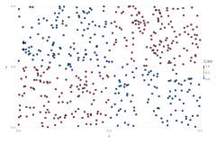
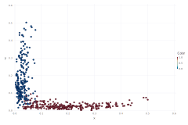

# knnFeat.jl
Julia wrapper for knnFeat(https://github.com/upura/knnFeat)

Feature Extraction with KNN

## Description
Julia implementation of feature extraction with KNN.

The following is R implementation:
http://davpinto.com/fastknn/articles/knn-extraction.html#understanding-the-knn-features

The following is Python implementation:
https://github.com/upura/knnFeat


## Demo

### Packages for visualization
```Julia
using Gadfly
```

### Data generation
```Julia
x1 = rand(500) - 0.5
x2 = rand(500) - 0.5
X = [x1 x2]
y = 1 * ((x1 .* x2) .> 0)
```

### Visualization


### Feature extraction with KNN
```Julia
include("knnFeat.jl")
newX = knnExtract(X, y, 1, 5)
```

### Visualization


## Reference
http://davpinto.com/fastknn/index.html

https://github.com/upura/knnFeat
